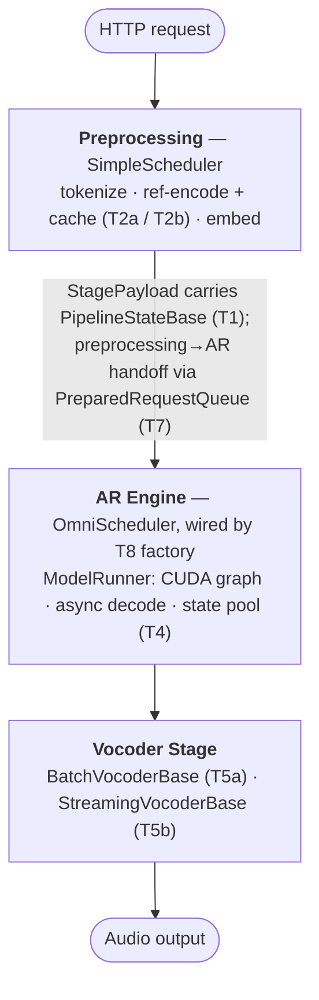
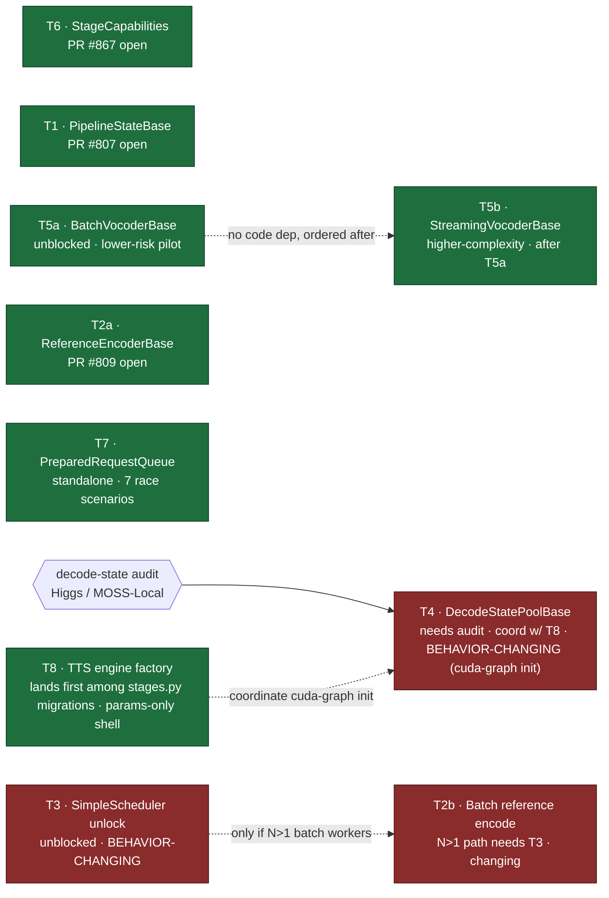
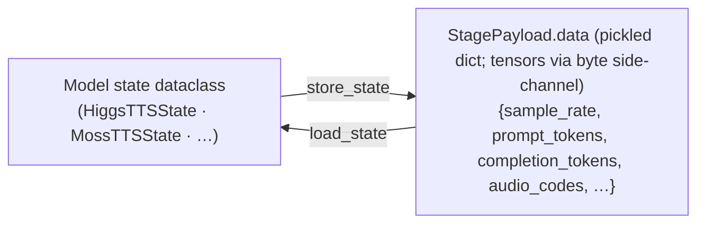
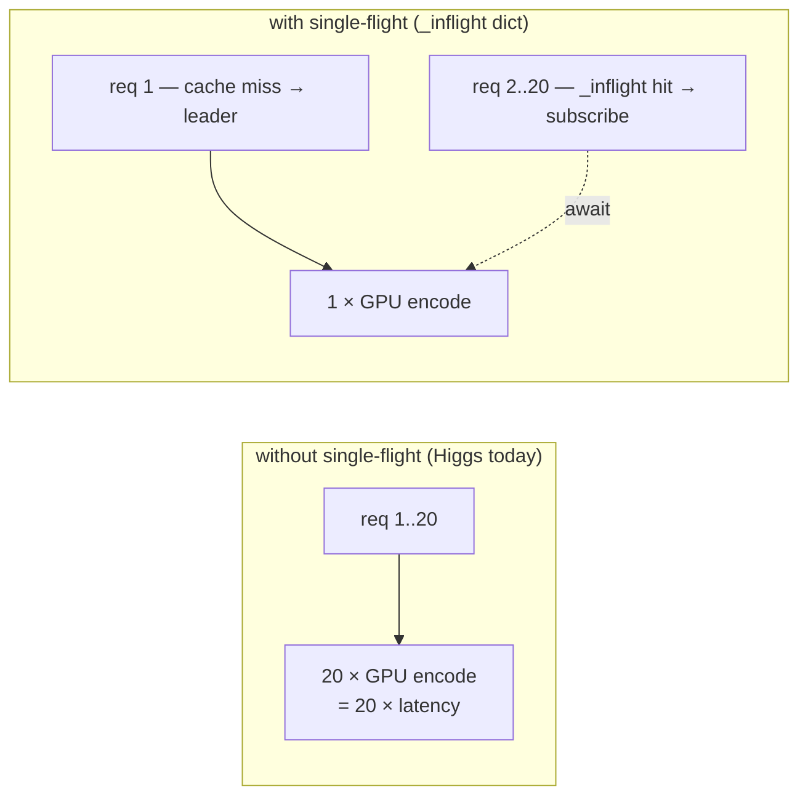
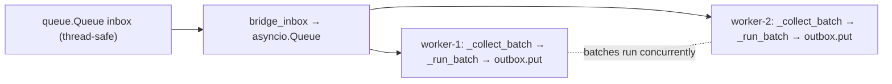
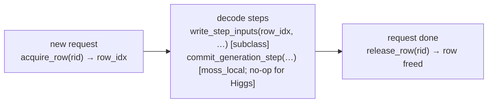
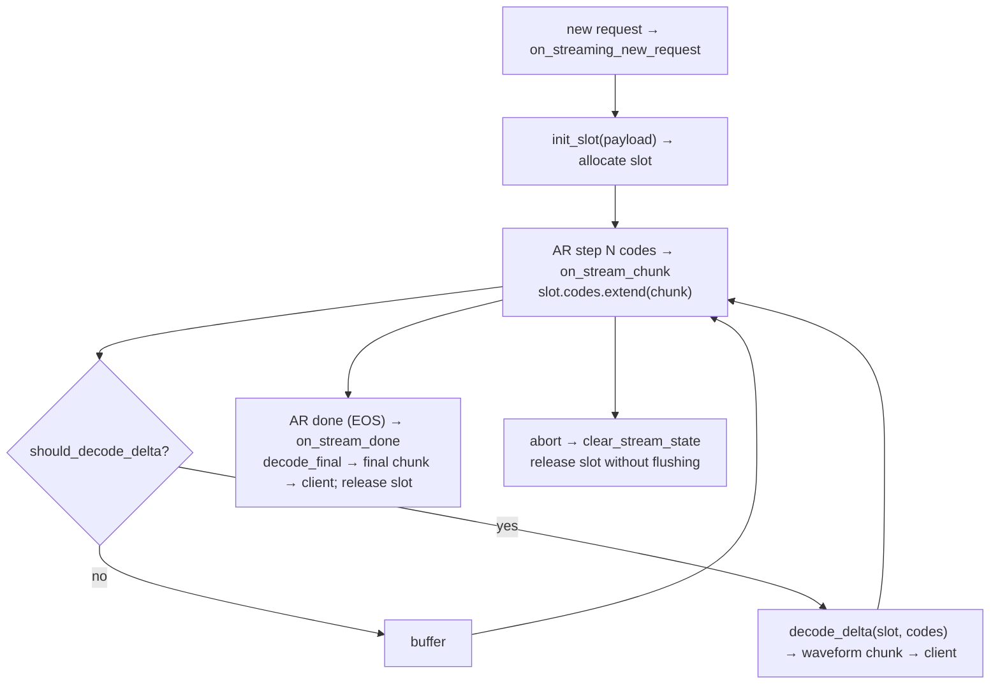
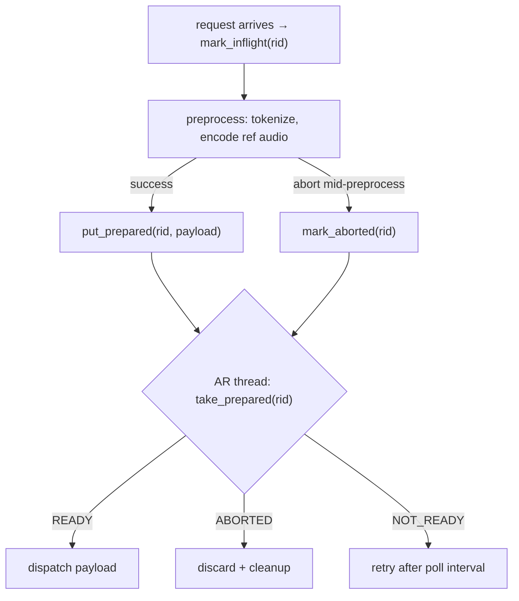

# SGLang-Omni Optimization RFC: Shared Base Classes for TTS Pipelines

**Status:** Draft  
**Author:** Yue Yin, Gaokai Zhang  
**Tracking issue:** [#661](https://github.com/sgl-project/sglang-omni/issues/661)  
**Last updated:** 2026-06-24 (PR/issue status verified against sgl-project/sglang-omni; code claims verified against the current tree)

---

## 1. Background

Every TTS model re-implements the same optimization mechanics from scratch — `higgs_tts`'s 547-line `vocoder_scheduler.py`, `moss_tts_local`'s 824-line `streaming_vocoder.py`, the ~80-line tombstone queue copy-pasted across moss / moss_local, and so on. Issue [#661](https://github.com/sgl-project/sglang-omni/issues/661)'s target: **framework owns reusable mechanics; model directories own model semantics.** This RFC operationalizes it as **eight top-level templates T1–T8** (T2 and T5 each split into a/b sub-templates — T2a/T2b, T5a/T5b — for ten deliverable units. The Stage / Scheduler / ModelRunner architecture itself is owned by the #188 line, PR #558, and is out of scope here — see §4.

**Scale.** The refactor *touches* ~5,400 LOC of optimization code across the 6 TTS models: **~3,430 is pure duplication removed**, replaced by **~3,800 of shared code** — ~1,300 one-time base plus ~2,560 thin adapters; the rest is model math that stays. Per-template:

| Template | Duplication removed |
|----------|---------------------|
| T1 — PipelineStateBase (6 models) | ~500 |
| T2a — ReferenceEncoderBase (5) | ~390 |
| T2b — Batch reference encode (5) | ~0 (adds a batch path; removes no duplication) |
| T3 — SimpleScheduler unlock | ~60 net |
| T4 — DecodeStatePool (2) | ~210 |
| T5a — BatchVocoderBase (3) | ~270 |
| T5b — StreamingVocoderBase (3) | ~1,482 |
| T6 — StageCapabilities | 0 (adds files) |
| T7 — PreparedRequestQueue (2) | ~160 |
| T8 — Engine factory (6) | ~360 |
| **Total** | **~3,430** |

T5b is ~half the gain; T1 is the most parallelizable. Net line count barely moves — the win is the same mechanics written once instead of 6×. The bigger LOC reduction is unit-test pruning — §16.

---

## 2. Design Principles

**P1 — No `tts_common` package.**  
Shared code lives in `scheduling/` or `model_runner/`, not in a new `models/tts_common/`. A `tts_common` peer directory re-creates the coupling problem at a different level. Design precedent: [PR #707](https://github.com/sgl-project/sglang-omni/pull/707), currently WIP.

**P2 — One code path per model. No dual backbones.**  
A migration must not leave a model with two parallel code paths. If the shared base class cannot express a model's existing feature, the fix is to **extend the base class's hooks** — not to keep the old path alive next to the new one "to preserve feature Y for model X". A model is either migrated — old code deleted in the same PR — or not migrated yet. Dual backbones defeat the purpose of the refactor and double the review and maintenance surface.

**P3 — Each template is classified behavior-preserving or behavior-changing.**  
🟢 **Behavior-preserving** — output is bit-identical or output-equivalent vs accuracy CI; only structure moves. These can be reviewed against the spec. 🟡 **Behavior-changing** — alters runtime semantics, scheduling timing, or concurrency. These must be **reviewed in isolation, never bundled with mechanical migrations.** The behavior-changing items are **T3** — it removes the `max_concurrency > 1` guard, a runtime-semantics change that can expose races; **T2b** — batch coalescing changes scheduling timing, and it depends on T3; and the **CUDA-graph init contract inside T4**. See the per-template classification in §3.

### How P2 is achieved: template method, hooks not branches

The mechanism that guarantees a single backbone is the **template method pattern**: the base class owns the *invariant skeleton* — the control flow identical across models; each model supplies only its *variant math* through narrow overridable **hooks**. Differences between models become *which hooks they override* — never *which code path runs*.

```python
class StreamingVocoderBase:
    # THE one backbone — slot lifecycle, windowing, flush, message
    # ordering live here once. No model reimplements this.
    async def step(self, slot: StreamingVocoderSlot) -> DecodedChunk:
        codes = self._take_ready_window(slot)          # shared
        wav = await self.decode_delta(slot, codes)     # hook ↓
        return self._emit(slot, wav)                   # shared

    # ---- model math: each model overrides only these ----
    async def decode_delta(self, slot, codes) -> torch.Tensor: ...
    async def decode_final(self, slot) -> torch.Tensor: ...

    # ---- optional capability: default no-op, models opt in ----
    def maybe_capture_cuda_graph(self) -> None:
        return None        # moss_tts_local overrides; others inherit the no-op
```

Three rules make this hold:

1. **Hooks, not branches.** Optional behavior is a hook with a safe default that models opt into by overriding — e.g. `moss_tts_local`'s CUDA-graph codec slots are an overridden `maybe_capture_cuda_graph`, not a second code path. No `if model == X`, no `enable_legacy` flag — per P2, a runtime switch between old and new *is* a dual backbone.

2. **Base = superset, hardest model first.** Migrate the *hardest* model as the **reference migration**: if the base expresses it purely through hooks, every simpler model fits. If a model surfaces a feature the base cannot express, **add a hook** — never fork a path. Picking the genuinely-hardest reference matters: for T5b that is **MOSS-Local**, for its cross-request coalescing, not Higgs — see §11.

3. **Migrate-or-delete, atomically**, per P2: the migration PR adds the subclass *and* deletes the old file in the same diff. This is also the §16 test-deletion discipline.

Distinct *modes* are not dual backbones: a model may subclass both `BatchVocoderBase` for non-streaming requests and `StreamingVocoderBase` for streaming requests — these are different operations, each with one backbone. P2 forbids two implementations of the *same* operation, not two genuinely different operations.

---

## 3. Scope

In scope: the six TTS models — `higgs_tts`, `moss_tts`, `moss_tts_local`, `qwen3_tts`, `fishaudio_s2_pro`, `voxtral_tts`. The Omni models — `qwen3_omni`, `ming_omni`, `llada2_uni` — are out of scope; they share some patterns and are a likely follow-up refactor.

### Templates

| # | Template | Status |
|---|----------|--------|
| T1 | Pipeline state serialization | 🔄 [PR #807](https://github.com/sgl-project/sglang-omni/pull/807) open |
| T2a | Reference audio encode / LRU cache / single-flight dedup | 🔄 [PR #809](https://github.com/sgl-project/sglang-omni/pull/809) open |
| T2b | Batched coalescing for reference encode (depends on T3) | ❌ Not started |
| T3 | Concurrent-batching scheduler | ❌ Not started |
| T4 | Async decode & CUDA graph capability contract | ❌ Not started |
| T5a | Batch vocoder base (non-streaming) | ❌ Not started |
| T5b | Streaming vocoder base | ❌ Not started |
| T6 | Stage capability vocabulary | 🔄 [PR #867](https://github.com/sgl-project/sglang-omni/pull/867) **open — not yet merged** |
| T7 | Preprocessing / AR engine handoff queue | ❌ Not started |
| T8 | TTS engine-factory orchestration (`build_tts_engine`) | ❌ Not started |

Each template's risk, scope, and ordering are in its section's lead block; the dependency DAG is in §4 and the cost + suggested order follow. Headlines: T2a/T5a are low-risk and land before their streaming/batching counterparts; T2b's **N>1 batch path** needs T3 — the `concurrency=1` path does not, §7; T5b follows the T5a pilot; T8 lands first among `stages.py` migrations, not gated on T6 — #867 can land in any order.

### Cost, behavior class, and suggested order

Rough effort/risk estimate to calibrate the difficulty ladder — not a commitment. Behavior class per **P3**: 🟢 preserving / 🟡 changing, reviewed in isolation.

**Est. code-change (LOC)** = the base-class code plus the adapter/subclass code each migration writes, as `base + per-migration ×count ≈ subtotal`. The old code each migration *deletes* is in the §1 consolidated table; a PR's review size ≈ this + the deletions, which must stay under the ~1K cap (§14) — that is why a delete-heavy migration like `moss_tts_local` under T5b is split out on its own.

| # | Behavior | Complexity | Est. PRs | Est. code-change (LOC) | Notes |
|---|----------|-----------|----------|-----------------------------------------------|-------|
| T1 | 🟢 preserving | Low | 1 base (#807) + 1 mig | ~120 + ~70×6 ≈ **540** | Pure serialization; fully parallel |
| T2a | 🟢 output-equivalent | Medium | 1 base (#809) + 1 mig | ~200 + ~80×5 ≈ **600** | Adds cache/dedup; same output, different timing |
| T2b | 🟡 **changing** | Medium–High | 1 base + 1 mig | ~60 + ~30×5 ≈ **210** | Batch coalescing changes scheduling timing; **depends on T3** |
| T3 | 🟡 **changing — review-heavy** | High | 1 PR (no migration) | ~60 net ≈ **60** | Removes the concurrency guard; may expose races; **review in isolation** |
| T4 | 🟡 partly changing | High | 1 base + 1 mig (higgs, moss_local) | ~180 + ~120×2 ≈ **420** | Pool extraction is preserving; **CUDA-graph init contract is behavior-sensitive** |
| T5a | 🟢 preserving | Low–Medium | 1 base + 1 mig | ~120 + ~90×3 ≈ **390** | **Lower-risk pilot** for `vocoder_base.py` |
| T5b | 🟢 preserving (intent) | **High** | base+ref + 2 (split) | ~300 + ~200×3 ≈ **900** | Deletes ~1,482 LOC total (§1); delete-heavy → **split per model**; after T5a |
| T6 | 🟢 preserving | Low | 1 PR (#867) | ~40 + ~10×6 ≈ **100** | No runtime change; **best onboarding task** |
| T7 | 🟢 preserving (queue) / 🟡 (new put-semantics) | Medium | 1 base + 1 mig (**2 models**: moss, moss_local) | ~120 + ~80×2 ≈ **280** | Abort semantics need care; `put_prepared`→bool is a behavior addition (§13) |
| T8 | 🟢 preserving | Medium | base+ref qwen3_tts + 1 mig | ~80 + ~30×6 ≈ **260** | Parameterized shell, shared primitives only; lands first among `stages.py` migrations; coord cuda-graph init w/ T4 (§3, Template 8) |
| Fish→OmniScheduler | 🟢 preserving | Medium | 1 PR | ~40 (net **−550**) | #476-style consolidation; **perf check** (§3 "Fish scheduler") |
| Quick wins | 🟢 preserving | Low | 1 small PR | ~20 (net negative) | `usage_payload` + promote `resolve_checkpoint` + `reverse_delay_pattern` |
| **Total** | | | **≈ 21 PRs** | **≈ 3,800 LOC** (code-change) | ~1,300 reusable base + ~2,560 adapters |

Totals reconcile with §1: **~3,800 LOC** of code-change — ~1,300 one-time base + ~2,560 thin adapters — buys deletion of the ~3,430 LOC of duplication. Net line count barely moves; the win is one reviewed copy instead of six.

**Suggested order (difficulty ladder, easy → hard):**

1. **Quick wins** — `usage_payload` + promote `resolve_checkpoint`; trivial, net-negative LOC. Warm-up task.
2. **T6** — pure capability declarations, zero runtime change; [PR #867](https://github.com/sgl-project/sglang-omni/pull/867) **open, not yet merged**.
3. **T1** — base already open (#807); mechanical migrations, fully parallel.
4. **T5a** — establishes the `vocoder_base.py` API as the low-risk pilot.
5. **T2a** — base already open (#809).
6. **T7** — handoff queue.
7. **T8** — engine-factory extraction; behavior-preserving but touches the bootstrap path, subsuming T4's cuda-graph init toggle.
8. **CUDA-graph parameter abstraction — T6 `supports_cuda_graph` + T4 init contract** — recommend settling this in the **#661 thread first**: which stages declare CUDA-graph eligibility, and how the init "disable-then-restore" dance is centralized. Agreeing the parameter surface before code makes T4 a clean rung rather than a cliff.
9. **T4** — decode-state pool, building on the agreed CUDA-graph contract.
10. **T5b** — highest complexity, streaming; only after T5a is merged and reviewed.
11. **T3** — behavior-changing concurrency unlock; **review in isolation**. **T2b** lands after it.

> **Build order — binding, distinct from the difficulty ladder above.** The list above is a *difficulty* ramp for picking up work; it is **not** the merge order. One hard rule overrides it: **T8 must merge before any other `stages.py`-touching migration** — the T1 / T2a / T5a / T7 *model* migrations — or two migrations collide on the same file, so land T8 right after the warm-up tasks even though it is harder than T1/T5a/T2a/T7. T8 does **not** consume T6's `CAPABILITIES` — see §3 Template 8 — so it is **not** blocked on #867.

### Template 8 — TTS Engine Factory (`build_tts_engine`)

> **Definition** — shared engine-bootstrap scaffold: the ~50–65-line `create_sglang_tts_engine_executor` wiring that every model copy-pastes.
> **Scope** — all 6 TTS factories: 5 use `create_sglang_tts_engine_executor`, **voxtral uses `create_generation_executor`**; `scheduling/engine_factory.py`. 🟢 behavior-preserving. **Lands first among migrations** — every model's `stages.py` build path routes through it, so it must merge before the other `stages.py`-touching migrations; coordinate cuda-graph init with T4. Does **not** consume T6 `CAPABILITIES` — see "T6 boundary" below — so it is **not** blocked on #867.
> **Refactor** — a **parameterized shell**: model-specific bits are passed as callbacks; the factory references only already-shared primitives (no T1/T4/T7 imports). The callback set is wider than a first sketch suggests — graph-init mode, post-build `set_stream_outbox`, per-model pre-`server_args` mutations, and FishScheduler's divergent params; see Target. Base + reference qwen3_tts, then 1 follow-up.

**Each migration PR must:**
- move the model's bootstrap wiring into a `build_tts_engine(...)` call;
- pass the model-specific bits — model build, adapters, runner, abort, graph-init, stream-outbox — as the documented callbacks;
- import **no** T1/T4/T7 base;
- re-point `config.py`'s dotted-string stage binding at the new shared factory.

**Problem.** Five models' `create_sglang_tts_engine_executor` — and voxtral's equivalently-shaped `create_generation_executor` — follow the same ~50–65-line orchestration: assemble an `overrides` dict → `build_sglang_server_args(...)` → `create_sglang_infrastructure(...)`, the same 7-tuple unpack → `SGLangOutputProcessor(...)` → wrap a `<Model>ModelRunner` → return `OmniScheduler`, or `FishScheduler` for fish. The sub-primitives `build_sglang_server_args` and `create_sglang_infrastructure` are already shared in `scheduling/`; only the wiring is copy-pasted, in each model's `stages.py` `create_*_engine_executor` / `create_generation_executor`. **Caveat — the CUDA-graph init dance is 5-of-6, not 6:** moss_tts_local / qwen3_tts / moss_tts / voxtral_tts / fishaudio_s2_pro each toggle `disable_cuda_graph` off-then-on and call `init_device_graphs()`, but **Higgs does not** — it captures inline through `create_sglang_infrastructure`. So the factory must make graph-init an **optional mode/hook**, not a hardcoded step, to stay behavior-preserving for Higgs.

**Target.** `scheduling/engine_factory.py`:
```python
def build_tts_engine(
    checkpoint, *, context_length, overrides, model_arch_override,
    build_model,            # callback: load weights/tokenizer, return model
    build_adapters,         # callback: return (request_builder, result_adapter)
    model_runner_cls,
    abort_callback=None,
    compile_hook=None,
    pre_server_args=None,   # callback: per-model mutation of server_args before build
    graph_init="inline",    # "inline" (Higgs) | "toggle" (the other 5: disable→init_device_graphs→enable)
    set_stream_outbox=None, # callback: post-build wiring some models need
    scheduler_cls=OmniScheduler,  # FishScheduler for fish (divergent required params)
) -> SimpleScheduler:
    ...  # shared path: server_args → infra → output_proc → scheduler_cls
```

**What the factory references — and what it must NOT.** The shared body touches **only already-shared primitives**: `build_sglang_server_args`, `create_sglang_infrastructure`, `SGLangOutputProcessor`, `OmniScheduler`/`FishScheduler` — none of which are T1–T7. Everything that touches a *new base* is passed in as an **opaque parameter / callback** and never imported by the factory:

| Wired thing | Owns | Reaches the factory as |
|-------------|------|------------------------|
| `request_builder` / `result_adapter` | T1 (state) + T7 (handoff/abort) | `build_adapters` callback return |
| `<Model>ModelRunner` | T4 (decode-state pool) | `model_runner_cls` param |
| `abort_callback` | T7 | param |
| compile / tokenizer / frame-graphs | model math | `compile_hook` / `build_model` |

So with the opaque-param design the factory has **no code dependency on T1/T4/T7** — it is ordered-after *only* the shared primitives, already in tree, and **T6** below. **This is a hard design rule, not an accident:** if the factory instead called `make_<model>_adapters()` or constructed the runner internally, it would reference T1/T4/T7 interfaces and slip to Wave 2/3. It must stay a parameterized shell — per P2, skeleton in the base, model bits in callbacks.

**T6 boundary — no consumption coupling.** Earlier drafts had the factory *read* `CAPABILITIES` to validate the runtime `overrides`. That is **not** what T6 mechanism-3 does — mechanism-3 is a *startup* check comparing `cuda_graph_eligible()` against `CAPABILITIES`, see §12, and it depends on a T4 runtime hook — and the factory does not need it to be behavior-preserving. **So the factory does not import or consume `CAPABILITIES`, and T8 has no hard dependency on T6**; #867 can land in any order. The factory still never re-derives per-model support — it takes model bits as callbacks, never `if model == …`.

**Ordering — land T8 first, before the other per-model migrations.** T8 rewrites each model's `stages.py` construction path. If T1/T2a/T5a/T7 migrations also edit `stages.py` concurrently, two otherwise-orthogonal migrations collide. So T8 lands **first within Wave 1**; the later migrations then only change the *callbacks they hand the factory* — the `request_builder` becomes a `PipelineStateBase` subclass, the `abort_callback` becomes a `PreparedRequestQueue` call — which keeps them orthogonal. Note `config.py` binds each stage factory by **dotted string**, so "reshapes `stages.py`" means re-pointing that binding plus moving the body — not a free structural win.

**Behavior-preserving** (🟢): a pure orchestration reshuffle that constructs the same engine. **Overlap with T4:** for the **5 models that do the disable/restore dance**, T4's `suppress_cuda_graph_during_init()` (§9c) becomes a one-liner here, `graph_init="toggle"`; **Higgs stays `graph_init="inline"`** with no toggle — coordinate T8 and T4. **Reference migration:** qwen3_tts, the simplest factory.

### Quick-win helpers (one small standalone PR)

Two byte-level duplications with no model math, extractable independently of any template:

- **`usage_payload(state)`** — the `{prompt_tokens, completion_tokens, total_tokens, +engine_time_s}` dict, duplicated ~11 LOC × 6 — e.g. `higgs_tts/vocoder_scheduler.py:525`, `qwen3_tts/stages.py:146`. New home beside `audio_waveform_payload` in `utils/audio_payload.py`.
- **`resolve_checkpoint(checkpoint)`** — the `isdir ? return : snapshot_download` resolver, copied ~6 LOC × 4 while `higgs_tts/utils.py:82` already exposes the shared version. Promote to `utils/hf.py`, delete the 4 private copies.

### Fish scheduler consolidation (#476-style)

`fishaudio_s2_pro` is the **only in-scope TTS model still on a bespoke AR scheduler**: its engine factory returns `FishScheduler`, backed by `fish_scheduler.py` — **591 LOC**: `FishBatchPlanner` / `FishResourceManager` / `FishIterationController` / `FishScheduler` — with **0 `OmniScheduler` imports**; the `stages.py` docstring claiming it returns OmniScheduler is stale. The other five — higgs, moss, moss_local, qwen3_tts, voxtral — all route through `OmniScheduler`. This is the exact four-class scheduler that **#476 already replaced for Higgs**.

A #476-style consolidation — routing fish's finish / stream / KV-cleanup through `OmniScheduler`'s existing `request_builder` / `result_adapter` / `abort_callback` hooks — **deletes ~590 LOC, behavior-preserving**. It needs a **perf check** — #476 noted the bespoke planner had slightly higher high-concurrency throughput. Wave 1. The coverage matrix's "Shared OmniScheduler" cell for fish is corrected to TODO.

### Delay-pattern transform (shared util)

Only the **reverse (de-delay)** direction is shareable. `[T + N - 1, N] → [T, N]` is implemented with structurally identical tensor math in two places — `higgs_tts/utils.py:reverse_delay_pattern` and `moss_tts/codec.py:apply_de_delay_pattern` — differing only in pad tokens. Two callers → passes the second-caller rule; a shared `reverse_delay_pattern(delayed)` util is a **~15–20 LOC, behavior-preserving** quick-win.

The **forward** direction is *not* shareable: higgs `apply_delay_pattern` is a tensor preprocessing op on reference codes, but **MOSS has no forward tensor function** — it produces the delay incrementally during AR decode via a state machine in `moss_tts/model_runner.py` — a per-request `delayed` counter plus `delay_slot` placeholder tokens, ~L217–382. That is model math, not a util; leave it in the model.

`moss_tts_local` is **not** a caller — the v1.5 variant dropped delay-pattern serialization in favor of async one-step lookahead; the other models are single-/non-multi-codebook — N/A in the matrix.

---

## 4. Where this fits in the architecture

The **Stage / Scheduler / ModelRunner** architecture — multi-process runner, declarative `StageConfig`, relay transport `HTTP API → Client → Coordinator → Stage → [Scheduler → ModelRunner → forward]` — is owned by the architecture RFC, the #188 line. **This RFC does not change that architecture**; it only adds reusable *optimization* base classes inside three of its layers. Canonical layout, with the dirs this RFC touches marked:

```
sglang_omni/
├── pipeline/      Coordinator · Stage · relay_io
├── scheduling/    OmniScheduler · SimpleScheduler · Code2WavScheduler    ← T3, T5a/b, T7, T8
├── model_runner/  ModelRunner base · FeedbackARModelRunner               ← T4
├── models/        per-model defs + pipeline configs (+ utils/)           ← T1, T2a/b, T6, quick-wins
└── config/ · relay/ · serve/ · client/ · proto/    (untouched)
```

**Template → layer**

| Layer (owned by the architecture RFC) | This RFC adds |
|---|---|
| **Pipeline** — Coordinator, Stage, relay_io | **T7** preprocessing→AR handoff queue |
| **Scheduling** — OmniScheduler (AR) / SimpleScheduler (non-AR) / Code2WavScheduler (streaming) | **T3** concurrent-batch unlock · **T5a/T5b** vocoder bases · **T8** engine factory |
| **ModelRunner** — base + FeedbackARModelRunner (callback pattern) | **T4** decode-state pool + CUDA-graph init contract |
| **Cross-cutting** — StagePayload, model dirs | **T1** state · **T2a/T2b** reference encode · **T6** capabilities · quick-wins (`usage_payload`, `resolve_checkpoint`, `reverse_delay_pattern`) |

The architecture RFC's `FeedbackARModelRunner` already factors the AR+codebook runner via per-model **callbacks** `write_buffers_fn` / `extract_output_fn` / `prefill_forward_fn` — the same hooks-not-branches shape as P2. T4 slots its decode-state pool and CUDA-graph init under that runner; T8's factory wires the runner into `OmniScheduler`.

### Pipeline flow (the TTS instance of the Stage chain)



**Template dependency flow** — color = behavior class per **P3**; solid edge = hard dependency, dashed = soft ordering:



**Green** = behavior-preserving — mechanical base-class extraction, review against the spec. **Red** = behavior-changing — runtime semantics / timing / concurrency, focused review per P3. Isolated green nodes T1, T2a, T5a, T6, T7 have no blockers and can start immediately. T5b is sequenced after T5a for risk, not code dependency; see §11.

---

## 5. Template 1 — Pipeline State Serialization (🔄 PR #807)

> **Definition** — shared per-request pipeline-state base that de-duplicates the hand-written `to_dict` / `from_dict` / `build_usage` boilerplate. **Tensor handling stays model-owned** — see "Tensor strategies"; the base does structural dedup, not a serialization policy.
> **Scope** — all 6 TTS models, with state in each `payload_types.py` except voxtral whose state lives in `io.py`; base in `scheduling/pipeline_state.py`. 🟢 for the structural dedup; **`schema_version` is opt-in** — a model adds the guard only if it wants it, and adding it is a behavior change, not free.
> **Refactor** — subclass `PipelineStateBase`, delete the structural boilerplate in the same PR, keep the model's tensor strategy. Base PR #807 + per-model migrations.

**File:** `sglang_omni/scheduling/pipeline_state.py`

**Problem:** the 6 TTS models each maintain near-parallel `to_dict` / `from_dict` (+ a `_tensor_*` helper) and a byte-identical `build_usage` dict, ~75 lines/model. The transport is **not** JSON — `pipeline/relay_io.py` pickles the payload and ships tensors through a byte side-channel that already round-trips shape/dtype/device — so tensor→list conversion is a per-model *choice*, not a transport requirement. The dedup target is the structural boilerplate + `build_usage`, **not** a unified tensor format — three strategies coexist, see below.

### How it works



```python
@dataclass
class PipelineStateBase:
    sample_rate: int = 24000
    prompt_tokens: int = 0
    completion_tokens: int = 0
    engine_time_s: float = 0.0
    schema_version: int | None = None   # opt-in fail-fast guard; None = no guard (preserves today's behavior)

    # tensor handling is NOT a base policy — the subclass owns it (see "Tensor strategies")

def load_state(payload: StagePayload, state_cls: type[StateT]) -> StateT: ...
def store_state(payload: StagePayload, state: PipelineStateBase) -> StagePayload: ...
def build_usage(state: PipelineStateBase) -> dict[str, Any] | None: ...
```

**Tensor strategies — model-owned; three coexist.** Because the relay already preserves dtype/device, each model chooses how its state carries tensors, and the base must **not** override this:
- **`.tolist()` round-trip** — qwen3_tts; fishaudio `audio_samples`; voxtral `audio_samples`.
- **keep CPU tensor** — moss_tts `delayed_audio_codes` and moss_tts_local `audio_codes` deliberately keep `.detach().cpu()` tensors. Forcing them to lists would be **behavior-changing**, so a base `serialize_value("tensor→list")` is wrong for these two.
- **raw bytes + dtype + shape**, with a legacy-list fallback — voxtral `audio_codes` via `_encode_audio_codes` / `_decode_audio_codes` in `io.py`. **This is the `TypedTensor` pattern**, and it is the reference the base should expose as the primary escape hatch for exact round-trips — not a footnote.

A subclass needing exact dtype/device round-trips uses the bytes+dtype+shape wrapper or its own `load_state`; the base never reconstructs GPU tensors on its own.

**Migration status:** PR #807 introduces the base class. Per-model migration — each state subclasses `PipelineStateBase` and deletes the duplicated boilerplate — is tracked in the coverage matrix `optimization-coverage.md`. No model has migrated yet.

---

## 6. Template 2a — Reference Audio Encode / LRU Cache / Single-Flight Dedup (🔄 PR #809)

> **Definition** — reference-audio encoder with content-keyed LRU + single-flight dedup. **Thread-first** — it matches the reference impl and how `SimpleScheduler` already runs preprocess in a worker thread.
> **Scope** — higgs / moss / moss_local / qwen3_tts / fish — 5 models; voxtral N/A, it rejects ref audio; `scheduling/reference_encoder.py` + `audio_ref.py`. 🟢 output-equivalent.
> **Refactor** — subclass `ReferenceEncoderBase`, implement the **sync** `encode_one`; the base provides the thread-safe LRU + single-flight. Delete the per-model cache/dedup. Base PR #809 + migrations. **Sequencing caveat:** the shared `SpeakerArtifactCache` has 3 consumers, below — it cannot be deleted in a single-model PR.

**Problem:** the in-scope models split **three** ways, not "two impls + three no-cache":

- **LRU, no single-flight** — Higgs **and qwen3_tts** both already use the shared global `SpeakerArtifactCache` via `get_speaker_artifact_cache()`. 20 concurrent requests for one voice still = 20 GPU encodes.
- **LRU + single-flight + batch** — `moss_tts_local`'s `CachedReferenceEncoder` is the reference impl, and it is **thread-based**: `concurrent.futures.Future` + `threading.Lock`, plus a `queue.Queue` daemon batcher — **no asyncio anywhere**.
- **no cache** — moss_tts and fishaudio_s2_pro encode every request.

So unification adds single-flight to the two LRU models and a cache to the two cache-less ones.

### Single-flight dedup

20 concurrent requests for the same `"alice.wav"`:



**Proposed file:** `sglang_omni/scheduling/reference_encoder.py`

`get_or_encode` is **synchronous** and thread-first, matching the reference impl and the execution model: `SimpleScheduler` with `max_concurrency>1` already dispatches the sync `preprocess_*` via `asyncio.to_thread`, so encoder code runs in a worker thread. An async `get_or_encode` would force that worker thread to spin a nested event loop to await it — strictly worse. Hence `_inflight` stores `concurrent.futures.Future` and single-flight uses a `threading.Lock`; an async adapter is added only if a future async caller appears.

```python
class ReferenceEncoderBase:
    def __init__(self, *, max_cache_bytes: int = ...) -> None: ...   # byte-bounded, not entry-count

    def encode_one(self, audio_ref: AudioRef) -> Any:
        """Model-specific SYNC encode hook. Runs in a worker thread; must be thread-safe
        (serialize internally if the GPU/ONNX module is not). Override per model."""
        raise NotImplementedError

    def get_or_encode(self, audio_ref: AudioRef) -> Any:
        """Sync cache-aware encode with single-flight dedup (threading.Lock + concurrent.futures.Future).
        Callers resolve the input with resolve_audio_ref() first.
        Concurrent requests for the same content_hash share one encode_one call."""
        ...
```

**Thread-safety note.** The worker pool can call `encode_one` concurrently. If a model's encoder — ONNX session, GPU module — is not safe for concurrent calls, the subclass serializes internally with a `threading.Lock` or a single model-owned worker thread. The RFC mandates that each migration PR documents its encoder's thread-safety posture, not a specific mechanism.

The `_inflight` dict maps `cache_key → concurrent.futures.Future`. The single-flight protocol (under `threading.Lock`):
1. Cache hit → return immediately
2. `_inflight[key]` exists → block on the existing future (subscriber path)
3. Neither → create future, insert into `_inflight`, call `encode_one(audio_ref)`, resolve future, cache result

**Inflight lifecycle rules** — common single-flight pitfalls:
- An inflight item **cannot be LRU-evicted** until its future resolves. Evicting mid-flight would strand subscribers.
- If `encode_one` raises, call `future.set_exception(exc)` for all subscribers, then **remove from `_inflight`** and **do not cache** the failure.
- Stale cached artifacts should be evictable normally after resolution.

**`AudioRef` helper.** Audio input arrives in three forms — file path, data URI, raw bytes — and every preprocessing path currently parses them independently. T2a introduces a small normalizer that all callers use:

```python
# sglang_omni/scheduling/audio_ref.py

@dataclass(frozen=True)
class AudioRef:
    """Content-addressable, normalized audio input. Created by resolve_audio_ref()."""
    kind: Literal["path", "data_uri", "bytes"]
    content_hash: str                 # SHA-256 of raw audio bytes; stable cache key component
    path: str | None = None
    data: bytes | None = None         # populated for data_uri/bytes; None for path refs
    mtime_ns: int | None = None       # for path refs; None otherwise
    size: int | None = None
    inode: int | None = None
    mime_type: str | None = None

def resolve_audio_ref(audio: str | bytes) -> AudioRef:
    """Parse path / data-uri / raw bytes into a single content-addressable AudioRef."""
    ...
```

`ReferenceEncoderBase.get_or_encode` accepts `AudioRef`, not a raw string. Benefits:
- cache key derivation is in one place (no per-model SHA-256 / mtime logic)
- preprocessing, benchmarks, and API input validation can all call `resolve_audio_ref` without duplicating the parsing logic
- framework owns audio-input mechanics, model owns encode logic

**`SingleFlightLRUCache` (internal for now).** `ReferenceEncoderBase` uses a `SingleFlightLRUCache` internally:

```python
class SingleFlightLRUCache:
    def get_or_compute(self, key: str, compute: Callable[[], Any]) -> Any: ...   # sync; threading.Lock inside
```

This is kept internal to `reference_encoder.py`. If a second caller emerges — e.g. `StageOutputCache` from #730 — promote it to `sglang_omni/scheduling/cache.py` at that point. No second caller → stays private. This is the second-caller rule.

**T2a can land independently of T3.** The single-request path `get_or_encode` does not require concurrent batching. T2b (§7) adds the `encode_batch` path after T3 merges.

**Cache key design.** The key must capture all factors that affect the encoded output:

```
cache_key = f"{model_id}/{model_revision}/{encoder_config_hash}/{content_key}"

encoder_config_hash covers: sample_rate_normalization, processor/tokenizer revision,
                             codec_config, speaker_encoder_version

content_key:
  - audio_content_hash (SHA-256 of raw bytes)   ← default; works for all payloads
  - path + mtime_ns + size + inode              ← opt-in for large local files
                                                   (avoids full read; mtime_ns more
                                                    precise than mtime; inode detects
                                                    rename+replace with same mtime)
```

`path + mtime + size` alone is not safe: a file can be overwritten with identical size and mtime within filesystem resolution. Content hash is the safe default; the path-based key is an explicit performance trade-off that migration PRs must opt into with a comment.

Without `model_id` in the key: a future multi-model-in-process setup could return Higgs codes when the caller expects MOSS embeddings. Without `model_revision` or `encoder_config_hash`: a processor config change — e.g. different sample rate normalization — silently returns stale artifacts.

**Cache device ownership.** Encoded artifacts may be tensors (embeddings, code sequences). Each migration PR must declare:
- Whether cached artifacts live on CPU or GPU
- How memory is bounded — **byte-bounded** (sum of artifact bytes ≤ budget), matching every real cache today, not a fixed entry count

Recommendation: cache on CPU, move to GPU at encode-caller site. Caching GPU tensors risks holding VRAM indefinitely, invisible to `nvidia-smi`.

**Key design decisions:**
- Cache scope is model-local. Artifacts are format-incompatible across models — Higgs: 8-codebook codes; Qwen3-TTS: speaker embeddings; FishAudio: VQ codes — so a shared cache has no reuse benefit.
- **`SpeakerArtifactCache` deletion is sequenced last.** It is a process-wide singleton with **three consumers** — `higgs_tts/stages.py`, `qwen3_tts/request_builders.py`, and `serve/speech_voices.py`. Deleting it in a single-model PR breaks the other two. Either keep it until all three migrate, or land one PR migrating higgs + qwen3_tts + speech_voices together — migrate-or-delete, §2 P2, applied at the right granularity.
- `moss_tts_local`'s thread-based `CachedReferenceEncoder` is the reference implementation.

**Prerequisite for `moss_tts`:** Reference encode is currently buried inside `create_preprocessing_executor()` / `_reference_for_processor()` in the request builder. T2a cannot be applied to `moss_tts` until issue #730's 3-stage → 4-stage split (`preprocessing → audio_encoder → tts_engine → vocoder`) is complete.

**Models affected:** higgs_tts, qwen3_tts, moss_tts_local, fishaudio_s2_pro — 4 in-scope; `moss_tts` after #730; voxtral N/A. ming_omni is out of TTS scope and its CampPlus ONNX encoder does not fit T2a.

---

## 7. Template 2b — Batched Reference Encode Coalescing (depends on T3)

> **Definition** — batch coalescing for reference encode (amortize GPU overhead across concurrent refs).
> **Scope** — same ref-audio models as T2a; `build_reference_encoder_scheduler()` in `reference_encoder.py`. **Dependency on T3 is optional**: at `max_concurrency=1` it reuses the existing un-guarded batch path and is 🟢; only N>1 batch-workers need T3 (🔴) and must be justified.
> **Refactor** — standalone factory wiring the encoder into the scheduler's batch path; if N>1, review in isolation.

**Problem:** `moss_tts_local` already coalesces concurrent refs — via a `queue.Queue` daemon-thread batcher inside `_BatchedReferenceEncoder`, fronted by a `SimpleScheduler(max_concurrency=16)` with **no** `batch_compute_fn`. Only the unbatched models — Higgs's `ThreadedSimpleScheduler` and the no-cache models — encode serially. So T2b is a **topology change** — move that batching into the scheduler's `_collect_batch`/`_run_batch` path — not a new capability.

**On the T3 dependency — often avoidable:** a single batched worker draining a FIFO — `max_concurrency=1` + `batch_compute_fn`, the qwen3_omni / qwen3_tts / higgs-vocoder pattern — already amortizes GPU overhead and needs **no** T3. The T3 dependency only appears if the factory hardcodes `max_concurrency>1`. Default to `max_concurrency=1`; reach for N>1, and T3, only if profiling shows a single batched worker underutilizes the GPU.

**Proposed addition to `ReferenceEncoderBase`:**

```python
def encode_batch(self, audio_refs: list[AudioRef]) -> list[Any]:
    """Optional SYNC batch encode. Default: map encode_one.
    Override where batching N encodes costs less than N × encode_one.
    Note: the default map() does NOT dedup within a batch — if the reference
    impl coalesces duplicate refs in one batch, preserve that in the override."""
    return [self.encode_one(r) for r in audio_refs]
```

After T3 merges, a standalone factory function wires the encoder into a concurrent-batching scheduler:

```python
# sglang_omni/scheduling/reference_encoder.py

def build_reference_encoder_scheduler(
    encoder: ReferenceEncoderBase,
    *,
    max_concurrency: int = 1,   # default 1 = no T3 needed; >1 (concurrent batch workers) requires T3
    max_batch_size: int = 8,
    max_batch_wait_ms: int = 5,
) -> SimpleScheduler:
    """Separate factory keeps ReferenceEncoderBase as a pure encode/cache/dedup object.
    ReferenceEncoderBase itself has no knowledge of SimpleScheduler."""
    ...
```

`ReferenceEncoderBase` does **not** have a `build_scheduler()` method. An encoder object that also constructs its own scheduler conflates cache/dedup concerns with concurrency-topology concerns — two different reasons to change. The factory function is the only coupling point.

**T2b is a follow-on to PR #809.** It does not block T2a from landing.

---

## 8. Template 3 — Concurrent-Batching Scheduler

> **Definition** — remove the `max_concurrency > 1` × `batch_compute_fn` mutual-exclusion guard in `SimpleScheduler`.
> **Scope** — `scheduling/simple_scheduler.py`; **1 PR, no per-model migration**; unblocks T2b. 🔴 behavior-changing.
> **Refactor** — delete the guard (`simple_scheduler.py:62-64`), then extend the **existing** batch path (`_collect_batch`/`_run_batch`) to the concurrent worker loop; preserve `max_batch_cost`/`request_cost_fn`; 8 correctness invariants; **review in isolation**.

**Problem:** `SimpleScheduler` at `simple_scheduler.py:62–64` raises if `max_concurrency > 1` and `batch_compute_fn` are both set. This blocks T2b's batched encode path. In-scope TTS stages run via `SimpleScheduler` / `ThreadedSimpleScheduler`; the change is to the shared base.

**Change:** Remove the guard, then let the concurrent worker loop reuse the existing batch logic. Today batching lives **only in the serial path** `_start_serial → _collect_batch → _run_batch`, which already implements FIFO collection, `max_batch_wait_ms`, ordered results via `zip`, the length-mismatch `ValueError`, and `max_batch_cost`/`request_cost_fn` cost-capping. The minimal correct change routes `max_concurrency > 1` through that same `_collect_batch`/`_run_batch` — each worker collects+computes a batch — **not** a new lock+future engine.

### Concurrency model

**Before (the real code).** `concurrency=1, batch_fn=fn` runs the **serial batch path** `_start_serial → _collect_batch → _run_batch` — FIFO collect, `max_batch_wait_ms`, ordered `zip` results, length-mismatch `ValueError`, `max_batch_cost`/`request_cost_fn` cost-cap. `concurrency=N, batch_fn=None` runs `_run_workers`: a `bridge_inbox` coroutine moves messages from the thread-safe `queue.Queue` inbox into an `asyncio.Queue`; N `worker()` coroutines each pull **one** message and run it via `asyncio.to_thread(self._run_compute_in_thread, …)`; results are delivered with `self.outbox.put()`. **There are no per-item `asyncio.Future`s and no `asyncio.Lock`** — callers read the outbox, they do not hold futures. `concurrency=N, batch_fn=fn` is the combination the guard at L62-64 forbids.

**After.** Let the concurrent worker loop collect+compute a **batch** instead of one item — reuse `_collect_batch`/`_run_batch` inside `worker()`. This preserves the tested batching semantics — including `max_batch_cost`/`request_cost_fn`, which cost-cap callers like qwen3_omni rely on — and keeps delivery via `outbox.put()`.



**Contract:** `batch_compute_fn` **may be sync or async** — `_run_batch` calls it directly and only `run_until_complete()`s the result if it is a coroutine. Every real batch fn today is a plain `def` — qwen3_omni `_encode_batch`, qwen3_tts / moss_tts `_vocode_batch`, higgs `decode_batch`; do **not** mandate `async`.

### Correctness contract

This change is **correctness-sensitive**. The PR must explicitly test all of the following invariants:

| # | Invariant | Test scenario |
|---|-----------|--------------|
| 1 | **Exclusive claim** | A request is processed by exactly one worker. No double-processing even under high concurrency. |
| 2 | **Concurrent compute** | Multiple workers can run `batch_compute_fn` concurrently once each has collected its batch (compute runs off-loop via `to_thread`). |
| 3 | **Cancellation safety** | Cancelling a request mid-queue leaves no dangling futures or queue items. |
| 4 | **Exception propagation** | An exception in `batch_compute_fn` propagates to every future in that batch, not just the first. Other batches are unaffected. |
| 5 | **`max_batch_wait_ms` semantics** | Under low load, an item waits at most `max_batch_wait_ms` then fires as batch-of-1. Under high load, the worker collects immediately. |
| 6 | **No busy loop** | A worker that finds the inbox empty after the wait window must `await asyncio.sleep(0)` to yield, not spin. |
| 7 | **FIFO ordering** | Batch drain always takes the oldest unclaimed items. A later-arriving item cannot be claimed before an earlier one. This is the starvation-freedom guarantee. |
| 8 | **Result ordering** | `batch_compute_fn` returns results in the same order as inputs. Violation is a contract error documented on the function. |

Implementation note: workers are coroutines in `_run_workers`'s event loop; the heavy compute runs off-loop via `asyncio.to_thread`. Delivery is via `outbox.put()` — callers read the outbox — so there are no per-item futures to await, and no new `asyncio.Lock` / `Future` machinery is introduced.

---

## 9. Template 4 — Async Decode & CUDA Graph Capability Contract

> **Definition** — row-indexed decode-state pool base + the CUDA-graph capability / init contract, under the `ModelRunner` layer (`FeedbackARModelRunner`).
> **Scope** — higgs + moss_local, the two with row-indexed pools; `model_runner/decode_state_pool.py` + `base.py` + `bootstrap.py`. 🔴 for the init contract. **Wave 3, gated on the decode-state audit; coordinate cuda-graph init with T8.**
> **Refactor** — subclass `DecodeStatePoolBase` (`acquire_row` / `release_row` / `commit_generation_step` / `padding_row`); init via `suppress_cuda_graph_during_init`.

**Existing foothold:** Commit `0bd807b` added `ModelRunner.lookahead_eligible(batch) -> bool`.

### 9a — Decode State Pool Protocol

Higgs — `HiggsTTSModel.acquire_row` / `release_row` / `_padding_row` in `higgs_tts/model.py` — and moss_tts_local — `MossTTSLocalDecodeStatePool` in `moss_tts_local/state_pool.py` — share the row-indexed pool concept.

**Why a row-indexed pool?** CUDA graph capture requires fixed tensor shapes. The pool pre-allocates P rows; each request gets a stable row index embedded in the captured graph.

**Pool layout**, `P = max_running_requests + 1` rows: rows `0..P-2` hold per-request model state, acquired or free; **row `P-1` is the padding row**, never acquired. Inactive decode positions in a batched CUDA-graph forward index into the padding row instead of a real request row — no branching, no out-of-bounds access.

**Lifecycle:**



```python
# sglang_omni/model_runner/decode_state_pool.py

class DecodeStatePoolBase:
    def acquire_row(self, request_id: str) -> int:
        raise NotImplementedError

    def release_row(self, request_id: str) -> None:
        raise NotImplementedError

    def commit_generation_step(self, request_id: str, steps: int = 1) -> None:
        pass  # default no-op; override in moss_tts_local

    padding_row: int  # set in __init__; the stable padding row index
```

**Where `release_row` is actually called — do not leak rows.** On **abort**, the scheduler's `abort_callback`, which is `model.reset_request`, frees the row. On **normal finish**, there is *no* scheduler callback — release is hand-inlined inside each model's `result_adapter` closure: `higgs_tts/request_builders.py` and `moss_tts_local/request_builders.py` both call `model.reset_request(...)`, which routes to `release_row`. A migration that extracts the pool and only wires `abort_callback` will **leak one row per completed request**. The `result_adapter` must retain its `reset_request` call — and since T8 moves `result_adapter` wiring into the factory shell, that call must be preserved across the T8 handoff.

**Decision — shared finish callback, open.** Normal-finish release is duplicated per-model and split awkwardly from the centralized abort path. Either (a) add an `OmniScheduler` `finish_callback` symmetric to `abort_callback` and route both through `release_row` in T4/T8, or (b) document that normal-finish release deliberately stays in `result_adapter`. Pick one — today it is neither templated nor explicitly excluded, which is exactly the duplication #661 targets. Tracked in §14.

**Migration for higgs_tts:** `HiggsBatchedSamplerState` is only GPU buffers, unchanged. The lifecycle methods — `acquire_row`, `release_row`, `_padding_row`, `_rid_to_row`, `_free_rows` — live on `HiggsTTSModel` and must be extracted into a new `HiggsDecodeStatePool(DecodeStatePoolBase)` subclass.

### 9b — CUDA Graph Capability Annotation

```python
# sglang_omni/model_runner/base.py (addition)

def cuda_graph_eligible(self) -> bool:
    """Whether this runner's decode step can be captured as a CUDA graph.

    Default False. CUDA graph capture requires careful validation:
    correct state pool shape, no Python-side branching in decode, and
    passing the perf regression gate (§15 Gate 3).

    Override to True only for runners that have been explicitly verified
    capture-safe. This aligns with StageCapabilities.supports_cuda_graph
    (T6), which also defaults to False.
    """
    return False

# lookahead_eligible(batch) already exists — not renamed.
```

**Why default False, not True?** T6's `StageCapabilities` fields all default to `False`. A default-`True` `cuda_graph_eligible` is inconsistent: any new ModelRunner subclass that forgets to override gets incorrectly assumed to be capture-safe, which can silently corrupt decode state or crash under CUDA graph replay. Note this is the **opposite polarity** from the sibling `lookahead_eligible`, which defaults **True** in `model_runner/base.py` — intentional: lookahead is opt-out, graph-capture is opt-in. `cuda_graph_eligible` is a **new** hook this template adds and does not exist in the tree yet; T6's runtime-consistency check, §12 mechanism-3, depends on it, so that T6 mechanism is gated on T4.

### 9c — CUDA Graph Init Dance (factory helper)

**Five of the six** contain identical 8-line blocks in `create_*_engine_executor` — moss_tts_local / qwen3_tts / moss_tts / voxtral_tts / fishaudio_s2_pro. **Higgs does not** — it captures inline via `create_sglang_infrastructure`, so Higgs's T4 PR is **pool extraction only (§9a)** and keeps its init path; do not pick Higgs as the §9c reference. The shared block:

```python
want_cuda_graph = not bool(getattr(server_args, "disable_cuda_graph", False))
if want_cuda_graph:
    server_args.disable_cuda_graph = True      # suppress during model init
# ... weight loading, torch.compile, codec init ...
if want_cuda_graph:
    server_args.disable_cuda_graph = False
if want_cuda_graph:
    model_worker.model_runner.init_device_graphs()
```

Extract to `sglang_omni/scheduling/bootstrap.py` using a context manager so the flag is always restored even if weight loading raises:

```python
@contextmanager
def suppress_cuda_graph_during_init(server_args) -> Generator[bool, None, None]:
    """Suppress CUDA graph capture during weight init; restore on exit.
    Yields want_cuda_graph so callers know whether to call init_device_graphs."""
    want = not bool(getattr(server_args, "disable_cuda_graph", False))
    if want:
        server_args.disable_cuda_graph = True
    try:
        yield want
    finally:
        if want:
            server_args.disable_cuda_graph = False

def maybe_init_device_graphs(model_worker, server_args, *, want_cuda_graph: bool) -> None:
    if want_cuda_graph:
        model_worker.model_runner.init_device_graphs()
```

Usage pattern in each `create_*_engine_executor`:

```python
with suppress_cuda_graph_during_init(server_args) as want_cuda_graph:
    # weight loading, torch.compile, codec init
    ...
maybe_init_device_graphs(model_worker, server_args, want_cuda_graph=want_cuda_graph)
```

The context manager guarantees `disable_cuda_graph` is restored even when weight loading raises. The original split pattern left `disable_cuda_graph=True` permanently if init failed.

Fold into T4 migration PRs; no separate PR needed.

**Note on `write_step_inputs`:** Not on the base class. The scheduler needs only `acquire_row` / `release_row` / `commit_generation_step` / `padding_row`. `write_step_inputs` is ModelRunner-facing and belongs in the subclass with model-specific types.

---

## 10. Template 5a — Batch Vocoder Base (non-streaming)

> **Definition** — non-streaming vocoder skeleton with three hooks (`prepare_item` / `decode_batch` / `store_result`).
> **Scope** — qwen3_tts as pilot / moss / voxtral on the non-streaming path; `scheduling/vocoder_base.py`. 🟢 — **lower-risk pilot** that establishes the `vocoder_base.py` API.
> **Refactor** — subclass `BatchVocoderBase`, implement the 3 hooks; for qwen3_tts/moss delete the existing batch-vocode closure, for voxtral **newly decompose** its inline `_vocode` (real work, not normalization).

**Problem:** `qwen3_tts` and `moss_tts` each implement a `prepare → decode_batch → store_result` loop inside `SimpleScheduler` — both expose `_prepare_vocoder_item` / `_store_vocoder_result` plus a `batch_compute_fn=_vocode_batch` — differing only in the decode call. **voxtral_tts does not** — it has a single inline `_vocode` with no prepare/store split and no batching, `return SimpleScheduler(_vocode)`. So 2 of 3 share the shape; voxtral must be decomposed into the hooks.

**Why T5a before T5b:** `BatchVocoderBase` is low-risk — no streaming state, no slot lifecycle, no message ordering. It is the pilot for the vocoder abstraction pattern. `StreamingVocoderBase`, T5b, lands only after T5a is stable and reviewed.

**Proposed file:** `sglang_omni/scheduling/vocoder_base.py`

```python
class BatchVocoderBase:
    def prepare_item(self, payload: StagePayload) -> tuple[PipelineStateBase, Any]:
        """Extract state and codec input from payload."""
        raise NotImplementedError

    async def decode_batch(
        self, items: list[tuple[PipelineStateBase, Any]]
    ) -> list[tuple[torch.Tensor, int]]:
        """Batch codec decode → (waveform, sample_rate) per item. Declared async for a
        uniform await interface; every in-scope codec is actually SYNC (incl. voxtral's
        decode_helper_batch_async) — implement `async def` with no internal await."""
        raise NotImplementedError

    def store_result(
        self, payload: StagePayload, state: PipelineStateBase,
        wav: torch.Tensor, sample_rate: int,
    ) -> StagePayload:
        raise NotImplementedError

    def build_scheduler(self, *, max_batch_size: int = 8, max_batch_wait_ms: int = 2) -> SimpleScheduler:
        """Wire the three hooks into a SimpleScheduler. Do not override."""
        async def _single(payload):
            state, codes = self.prepare_item(payload)
            results = await self.decode_batch([(state, codes)])
            wav, sr = results[0]
            return self.store_result(payload, state, wav, sr)

        async def _batch(payloads):
            items = [self.prepare_item(p) for p in payloads]
            results = await self.decode_batch(items)
            if len(results) != len(items):
                raise RuntimeError(
                    f"decode_batch returned {len(results)} results for {len(items)} inputs"
                )
            return [
                self.store_result(p, s, wav, sr)
                for p, (s, _), (wav, sr) in zip(payloads, items, results)
            ]

        return SimpleScheduler(_single, batch_compute_fn=_batch,
                               max_batch_size=max_batch_size, max_batch_wait_ms=max_batch_wait_ms)
```

`decode_batch` is declared `async` only for a uniform await interface — **not** because any codec is natively async; every in-scope codec, including voxtral's `decode_helper_batch_async`, is a sync `def`. Models implement `async def` with no internal `await`.

**Migration order for T5a:**
1. `qwen3_tts` — base + reference migration; pilot, non-streaming, simplest, already has the 3-part shape
2. `moss_tts` + `voxtral_tts` — follow-up, one PR. moss_tts already has the shape; **voxtral must be decomposed**: warmup-prepend → `prepare_item`/`decode_batch`, trim + fade-in → `store_result`. #718 attempted this, closed unmerged — re-land under `BatchVocoderBase`

---

## 11. Template 5b — Streaming Vocoder Base (high risk, lands after T5a)

> **Definition** — streaming vocoder skeleton + request-keyed slot lifecycle (`StreamingVocoderSlot`, `DecodedChunk`). **The cursor model is NOT yet validated** — the three vocoders track position three different ways, below, so the reference PR must prove the contract against real code before it is declared final.
> **Scope** — higgs / fish / moss_local, the 3 in-scope streaming vocoders; `scheduling/vocoder_base.py`. 🟢 in intent, **highest-complexity**; after T5a; **split per model**. qwen3_omni is out of TTS scope — API-validation reference only.
> **Refactor** — subclass `StreamingVocoderBase`, override the decode hooks; the base owns request-keyed slot lifecycle via the **real** `StreamingSimpleScheduler` hooks (`on_streaming_new_request` / `on_stream_chunk` / `on_stream_done`), **not** a shared code buffer.

**Problem:** Higgs, FishAudio, and moss_tts_local each subclass `StreamingSimpleScheduler` with the same *shape* — slot on new-request, accumulate on stream-chunk, delta-decode on threshold, flush on stream-done — but **different cursor handling** — see "Cursor contract". qwen3_omni's `code2wav` shares the shape too, but is out of TTS scope, API-validation only.

**Why T5b is higher risk than T5a:** Streaming behavior involves slot lifecycle, chunk accumulation strategy, message ordering guarantees, abort cleanup, and — for moss_tts_local — CUDA graph codec slots. A regression in T5b means broken live streaming. The migration order deliberately starts with the reference implementation, higgs_tts, before touching the CUDA-graph vocoder, moss_tts_local.

**T5b has no code dependency on T5a.** `BatchVocoderBase` and `StreamingVocoderBase` are independent abstractions. T5a is sequenced first as a lower-risk pilot for `vocoder_base.py` that validates the hook structure and reviewer expectations before the more complex streaming hooks land. If T5a review surfaces an API design problem, T5b absorbs the lesson at no cost.

| Model | File | Lines | Cursor / note |
|-------|------|-------|---------------|
| `higgs_tts` | `vocoder_scheduler.py` | 547 | sample/frame-domain (`emitted_raw_frames`), overlap re-decode |
| `fishaudio_s2_pro` | `streaming_vocoder.py` | 471 | trims its own buffer + `pending_tail` crossfade |
| `moss_tts_local` | `streaming_vocoder.py` | 824 | **hardest** — stateful codec session + cross-request coalescing |

qwen3_omni `components/code2wav_scheduler.py` ~289 LOC shares the shape but is **out of TTS scope** — validate the API against it, do not migrate it.

### Slot lifecycle

The AR engine (talker) drives `StreamingVocoderBase` via these callbacks:



**Cursor contract — model-owned; the flat-buffer model does NOT fit all three.** Streaming decoders decode codes in windows, but the three vocoders track position three different ways:
- **Higgs** — sample/frame-domain via `emitted_raw_frames`; re-decodes an *overlapping* window and trims samples. Not a monotonic code index.
- **Fish** — `last_vocode_tokens` + `code_start_token`, and **actively shrinks** its own code buffer via `trim_retained_stream_codes` plus a `pending_tail` crossfade.
- **MOSS-Local** — deletes consumed pending frames and relies on a **stateful causal codec session**, so re-passing `codes[offset:]` would double-decode.

So a base that owns one append-only `slot.codes` and passes `slot.codes[consumed_code_offset:]` is contradicted by Fish, which trims, and wrong for MOSS, which is stateful. **The base must NOT own the cursor.** Make it opaque: the subclass owns *all* cursor / buffer / session state; the base forwards the raw `StreamItem` and lets the subclass decide what to decode. `StreamingVocoderSlot` is a *minimum*:

```python
@dataclass
class StreamingVocoderSlot:
    """MINIMUM slot state owned by the base. Cursor/buffer/session fields are MODEL-OWNED
    (Higgs emitted_raw_frames; Fish last_vocode_tokens + pending_tail; MOSS codec session)."""
    request_id: str
    chunk_index: int = 0
    sample_rate: int = 24000
    # subclass adds: code buffer, cursor/offset, codec session, crossfade tail, …
```

Code accumulation and the decode window are **model-owned** per the contract above; the base does not slice a shared buffer. **The reference PR must implement Higgs's overlap cursor and Fish's buffer-trim against this contract before it is declared final.**

Decoded output is returned as a `DecodedChunk` — richer than a bare tensor to avoid locking future models out of metadata they need — latency accounting, chunk index, overlap discard:

```python
@dataclass
class DecodedChunk:
    wav: torch.Tensor | None          # None if not enough codes yet to produce audio
    sample_rate: int
    consumed_until: int               # new absolute value for slot.consumed_code_offset
    is_final: bool = False
    metadata: dict[str, Any] = field(default_factory=dict)
```

When `wav is None`, the base emits **no** client chunk for that step — no `make_audio_message` call. Cursor advancement is the subclass's responsibility; the base does not own `consumed_code_offset`.

```python
class StreamingVocoderBase(StreamingSimpleScheduler):
    # Base machinery = the REAL StreamingSimpleScheduler hooks (these exist today):
    #   on_streaming_new_request(request_id, payload) → init_slot, store request-keyed
    #   on_stream_chunk(request_id, item)             → should_decode_delta / decode_delta
    #   on_stream_done(request_id)                    → decode_final, then clear_stream_state
    #   _clear_request_state(request_id)              → clear_stream_state under _state_lock

    def init_slot(self, request_id: str, payload: Any) -> StreamingVocoderSlot:
        raise NotImplementedError

    def should_decode_delta(self, slot: StreamingVocoderSlot, item: StreamItem) -> bool:
        raise NotImplementedError

    def decode_delta(self, slot: StreamingVocoderSlot, item: StreamItem) -> DecodedChunk:
        """Decode whatever the slot's OWN cursor says is ready (the base does NOT pre-slice a
        shared buffer — cursor is model-owned, see the cursor contract). wav=None if not enough yet."""
        raise NotImplementedError

    def decode_final(self, slot: StreamingVocoderSlot) -> DecodedChunk:
        """Flush remaining codes. is_final=True in the returned DecodedChunk."""
        raise NotImplementedError

    def make_audio_message(self, request_id: str, chunk: DecodedChunk) -> OutgoingMessage:
        raise NotImplementedError

    def clear_stream_state(self, request_id: str) -> None:
        """Release the slot (default: pop from the base's request-keyed slot dict).
        Override for extra cleanup (e.g. MOSS-Local returning CUDA-graph capture slots).
        NOTE: there is no `_release_slot` in StreamingSimpleScheduler — do not call it."""
        ...
```

**MOSS-Local does not fit these per-request hooks as-is.** Its `_pump_streams` coalesces *multiple* live requests' codes into one `session.step()` and emits messages for *peer* requests while handling one request's chunk; it also has a slot-starved whole-utterance `decode_offline` fallback. The single-request `decode_delta(slot, item)` shape cannot express cross-request batching. So either **carve MOSS-Local out of T5b** (treat it as a batched coalescing scheduler) or **add a base cross-request pump hook**. Its CUDA-graph runner is the *least* of the mismatch — the coalescing/session model is the blocker, and it is why MOSS-Local, not Higgs, is the genuinely-hardest streaming vocoder — §2 "hardest model first".

**Migration order for T5b (3 in-scope models):**
1. `higgs_tts` — first cut: streaming, no CUDA-graph codec, simplest cursor.
2. `fishaudio_s2_pro` — buffer-trim + crossfade cursor.
3. `moss_tts_local` — **the hard one**: stateful codec session, cross-request coalescing — resolve the per-request-vs-coalescing mismatch above — and CUDA-graph capture-slot return in `clear_stream_state`.

The cursor contract should be proven against MOSS-Local, the hardest, **early** — consider validating the base design on it before finalizing, even if Higgs lands first. qwen3_omni `code2wav` is checked against the API but **not migrated** — out of TTS scope.

---

## 12. Template 6 — Stage Capability Vocabulary

> **Definition** — per-model static capability declaration: `CAPABILITIES`, `supports_*` fields, all default False.
> **Scope** — all 6 TTS plus any registered model; `models/stage_capabilities.py` + each `__init__.py`. 🔄 **PR #867 open — not yet merged**; `stage_capabilities.py` is not in the tree yet. 🟢 no runtime change.
> **Refactor** — each model exports `CAPABILITIES`; registry logs the table at startup; a CI presence test asserts every model declares it.

**Problem:** Whether a model supports CUDA graph, async decode, or streaming vocoder is currently undocumented or scattered in comments. CI cannot route by capability programmatically: test selection today requires `if model_name == "higgs_tts":` hardcoded branches. After T6, CI reads `CAPABILITIES` directly:

```python
@pytest.mark.parametrize("model", [m for m in ALL_MODELS if m.CAPABILITIES.supports_cuda_graph])
def test_cuda_graph_decode(model): ...
```

New models that set `supports_cuda_graph=True` are automatically included in the CUDA graph test sweep without touching CI config.

**Proposed file:** `sglang_omni/models/stage_capabilities.py`

```python
@dataclass(frozen=True)
class StageCapabilities:
    """Static per-model capability annotation.

    Semantics: 'this model supports this optimization under its default config.'
    NOT 'this optimization is currently enabled at runtime.'
    Runtime gating uses T4's lookahead_eligible() / cuda_graph_eligible() hooks.

    All fields default to False. Override to True only for capabilities that
    have been verified and are passing accuracy + perf CI.
    """
    supports_cuda_graph: bool = False
    supports_async_decode: bool = False
    supports_torch_compile: bool = False
    supports_streaming_vocoder: bool = False
    supports_reference_audio: bool = False
    # NOTE: supports_thinker_tp dropped from the initial vocabulary — no in-scope TTS model uses
    # thinker tensor-parallelism (it lives only in out-of-scope ming_omni). Add it in an Omni pass.
```

Field naming rationale: `supports_*`, not `*_eligible` — "eligible" implies a runtime condition; "supports" is a static declaration of capability.

```python
# models/higgs_tts/__init__.py
CAPABILITIES = StageCapabilities(
    supports_cuda_graph=True,
    supports_async_decode=True,
    supports_torch_compile=True,
    supports_streaming_vocoder=True,
    supports_reference_audio=True,
)
```

### Enforcement to prevent staleness

Without enforcement, `CAPABILITIES` becomes documentation that drifts from reality. Four mechanisms:

1. **Startup log:** the model registry logs the full capability table at startup. Reviewers and operators can see what is declared.

2. **CI presence check:** a simple unit test asserts that every registered model exports `CAPABILITIES` with the expected type. New model PRs that forget to add `CAPABILITIES` fail CI.

3. **Runtime consistency warning, gated on T4:** `cuda_graph_eligible()` does **not** exist in the tree yet — only `lookahead_eligible` does; **T4 adds it**. Once it exists: at startup, if `model_runner.cuda_graph_eligible()` is `True` but `CAPABILITIES.supports_cuda_graph` is `False`, emit a `WARNING` — the runner thinks it can capture graphs, but the static declaration says it cannot. Only warn when the runtime *exceeds* the static declaration, not when it *falls below* — the reverse is expected when the user sets `disable_cuda_graph=True`. Before T4 lands, compare against the resolved `not server_args.disable_cuda_graph` after stage init instead.

4. **Documented semantics:** `CAPABILITIES` represents static/default capability. Config overrides such as `disable_cuda_graph=True` are valid runtime deviations and do not invalidate the static declaration.

---

## 13. Template 7 — Preprocessing / AR Engine Handoff Queue

> **Definition** — preprocessing→AR handoff queue. The real consumer today is **one-shot pop-or-raise**, effectively two states: present / aborted; the RFC's tri-state `NOT_READY` poll is a **forward-looking addition**, see "Behavior delta", not current behavior.
> **Scope** — **moss + moss_local**, the two ~80-line tombstone queues in `request_builders.py`; `scheduling/prepared_request_queue.py`. 🟢 for the queue extraction; **🟡 for the new put/poll semantics**. **qwen3_tts is NOT in scope** — it has only a 1-dict pattern with no `_INFLIGHT`/`_ABORTED`, so putting it on the tri-state queue would add unused inflight/aborted tracking.
> **Refactor** — replace the per-model tombstone queue with `PreparedRequestQueue`; race-scenario contract test; use #707's `attach_sglang_req_attrs()` when it lands.

**Problem:** `moss_tts` and `moss_tts_local` each implement an identical ~80-line tombstone queue in `request_builders.py` to hand off prepared requests across the asyncio/thread boundary:

```python
_PREPARED_REQUESTS: dict[str, PreparedRequest] = {}
_INFLIGHT_REQUESTS: set[str] = set()
_ABORTED_REQUESTS: set[str] = set()
_PREPARED_REQUESTS_LOCK = threading.Lock()
```

This pattern is **correctness-critical**. Getting the abort-ordering wrong causes ghost requests — GPU slots held indefinitely — or use-after-free on the prepared payload.

### Handoff flow

Producer = asyncio event loop (preprocessing); consumer = AR-engine thread. The consumer's `take_prepared` returns one of three states:



**Proposed file:** `sglang_omni/scheduling/prepared_request_queue.py`

The return type of `take_prepared` must distinguish three states, not two. Returning `None` for both "not ready" and "aborted" conflates:

- **Case A:** preprocessing still running, AR engine polled too early → should retry / wait
- **Case B:** request was cancelled → should discard and cleanup

Silently treating Case A as Case B drops a valid request with no error.

```python
class PreparedStatus(Enum):
    READY = "ready"
    NOT_READY = "not_ready"   # preprocessing still in flight, poll again
    ABORTED = "aborted"       # request cancelled, discard and cleanup

@dataclass
class PreparedResult:
    status: PreparedStatus
    payload: Any | None = None  # set only when status == READY

class PreparedRequestQueue:
    """Thread-safe handoff queue for the asyncio-preprocessing / AR-engine boundary."""

    def mark_inflight(self, request_id: str) -> None: ...
    def put_prepared(self, request_id: str, payload: Any) -> bool:
        """Returns False if request was already aborted. Caller skips and cleans up."""
        ...
    def mark_aborted(self, request_id: str) -> None: ...
    def take_prepared(self, request_id: str) -> PreparedResult:
        """
        READY    → atomically removes payload from dict and returns it
        NOT_READY → request is inflight but preprocessing not done; caller must poll
        ABORTED  → caller discards and calls cleanup()
        """
        ...
    def cleanup(self, request_id: str) -> None: ...
```

**Behavior delta — T7 is not purely behavior-preserving on the put/poll paths.**
- **`NOT_READY` / polling does not exist today.** The current AR consumer — `pop_prepared_moss_tts_request` and its moss_local twin — is **one-shot: returns the payload or raises** — no poll/retry, because preprocessing is a separate `SimpleScheduler` stage whose result feeds the AR stage sequentially, so the payload is already published or tombstoned before the AR builder runs. So `NOT_READY` is forward-looking, for a future async-lookahead AR path; label it not-yet-exercised and don't let the contract test assert it as current behavior.
- **`put_prepared`→`bool` and double-put→`ValueError` are additions.** Today `preprocess_*_payload` checks `_ABORTED_REQUESTS` inline and conditionally inserts; nothing returns a bool or raises on double-put. Adopting them is fine, but it makes the put path a behavior change (🟡), and the migration must rewrite `preprocess_*` to branch on the returned bool.

The AR engine's polling loop, once `NOT_READY` exists, becomes:

```python
# pseudocode — actual AR engine uses its existing polling/sleep primitive
result = queue.take_prepared(req_id)
if result.status == PreparedStatus.READY:
    schedule(result.payload)
elif result.status == PreparedStatus.ABORTED:
    cleanup(req_id)
    return
else:  # NOT_READY
    sleep(POLL_INTERVAL)  # via asyncio.sleep or thread sleep, per AR engine's threading model
    # retry
```

### Race condition test matrix

The PR introducing `PreparedRequestQueue` must include tests covering all of the following scenarios:

| Scenario | Expected behavior |
|----------|------------------|
| `mark_aborted` called before `put_prepared` | `put_prepared` returns `False`; `take_prepared` returns `ABORTED` |
| `mark_aborted` called after `put_prepared`, before `take_prepared` | `take_prepared` returns `ABORTED`; payload is cleaned up |
| `take_prepared` races with concurrent `mark_aborted` | Exactly one of: take returns `READY` (abort is no-op), or `ABORTED` (abort wins). No payload lost. |
| `take_prepared` called before `put_prepared` (request still inflight) | Returns `NOT_READY`. AR engine retries. |
| `cleanup` called twice for same request | Idempotent; no panic, no missing cleanup |
| `put_prepared` called twice for same request | Second call raises `ValueError` — double-put is a caller bug, not a valid race |
| `mark_inflight` then `cleanup` without `put_prepared` | `_inflight` and `_aborted` sets have no leak |

**Models affected:** `moss_tts`, `moss_tts_local`. `qwen3_tts` uses a simpler 1-dict pattern without tombstone logic and is not in scope for T7.

---

## 14. PR Plan by Wave

Plan by wave so rollout order is explicit. **Templates within a wave are independent and land in parallel.** Scope is TTS-only: `higgs_tts`, `moss_tts`, `moss_tts_local`, `qwen3_tts`, `fishaudio_s2_pro`, `voxtral_tts`.

**PR packaging:** **PR 1 = base + its hardest-model reference migration**, then **PR 2 = the remaining models** — split per model only if >1K, currently only T5b. Every PR ≤1K.

**Conventions.** `[x]` = merged · `[ ]` = open or not started. A migration is *done* when the model is rewired to the base **and the old path is deleted in the same PR** (§2 P2), the contract test passes, and accuracy CI is unchanged. Risk per §2 P3: 🟢 behavior-preserving · 🔴 behavior-changing — focused review per §2 P3.

### Wave 1 — unblocked, start now

| Template | Risk | PRs |
|----------|------|-----|
| T1 · PipelineStateBase | 🟢 preserving | base #807 (open) + 1 follow-up (5 models) |
| T2a · ReferenceEncoderBase | 🟢 preserving | base #809 (open) + 1 follow-up, 4 models — **sequence the `SpeakerArtifactCache` deletion across higgs + qwen3_tts + speech_voices** (§6) |
| T5a · BatchVocoderBase | 🟢 preserving | base + ref qwen3_tts, then 1 follow-up — moss + voxtral; voxtral is a decompose, not a one-liner |
| T6 · StageCapabilities | 🟢 preserving | PR #867 open — base + all 6 declarations in one |
| T7 · PreparedRequestQueue | 🟢 queue / 🟡 put-path | base + ref moss_tts, then 1 follow-up — **moss_tts_local** only, a 2-model template |
| T8 · TTS engine factory | 🟢 preserving | base + ref qwen3_tts, then 1 follow-up, 5 models — **land first among `stages.py` migrations**; not gated on T6; coordinate cuda-graph init w/ T4 (§3, Template 8) |
| T3 · SimpleScheduler unlock | 🔴 **changing** | 1 PR, no migration — gates T2b; **review in isolation** |
| Fish → OmniScheduler | 🟢 preserving | 1 PR — #476-style consolidation, ~590 LOC deleted; **perf check** (§3 "Fish scheduler") |
| Quick wins · `usage_payload` + `resolve_checkpoint` + `reverse_delay_pattern` | 🟢 preserving | 1 small standalone PR |

### Wave 2 — after Wave 1

| Template | Risk | PRs |
|----------|------|-----|
| T2b · Batch reference encode | 🟢 at `concurrency=1` / 🔴 at N>1 | base + ref higgs, then 1 follow-up, 4 models — only the **N>1** batch path needs T3 (§7) |
| T5b · StreamingVocoderBase | 🟢 preserving (intent), high-complexity | base + ref higgs, then fish + moss_local **split per model**, delete-heavy — after T5a |

### Wave 3 — after the cross-model decode-state audit

| Template | Risk | PRs |
|----------|------|-----|
| T4 · DecodeStatePoolBase | 🔴 **changing** (CUDA-graph init contract) | base + ref higgs — **pool-only, no init dance** — then moss_local; **also decide the shared normal-finish `finish_callback`** (§9a) |

Prerequisite for T4: audit the row-indexed pool across Higgs / MOSS-Local first (the contract must assert row-address stability across `acquire_row` / `release_row`), and coordinate the cuda-graph init contract with T8 (Wave 1, which subsumes the toggle). **The audit is T4's only hard gate** — there is no code dependency on T5a/T5b; landing it after the vocoder migrations is a soft preference (cleaner code to read), not a requirement.

**Standalone thrusts (tracked alongside the templates, not folded into a single migration):**
- **Redundant unit-test pruning** — §16; the single largest LOC win. ~13.0k is reachable inside the TTS migrations, but ~30k (pipeline / qwen3_omni / ming_omni / serve / router + orphan model tests) needs its own owned pass.
- **Fish → OmniScheduler consolidation** — Wave 1 row above (~590 LOC, #476-style).
- **Shared normal-finish `finish_callback`** — decided with T4 (§9a); removes the per-model `reset_request` glue.

### Live task lists (update as PRs land)

```
T1 — PipelineStateBase
- [ ] base — #807 (open)        ← reference migration lands with / right after it
- [ ] migration: remaining 5 TTS models (one PR) — ⟨#TBD⟩

T2a — ReferenceEncoderBase   (voxtral N/A — rejects reference audio)
- [ ] base — #809 (open)        ← + higgs reference migration
- [ ] migration: moss_local / qwen3_tts / fish + moss after #730 (one PR) — ⟨#TBD⟩

T5a — BatchVocoderBase   (non-streaming path)
- [ ] base + reference: qwen3_tts (pilot) — ⟨#TBD⟩
- [ ] migration: moss_tts + voxtral_tts (one PR) — ⟨#TBD⟩
      note: moss_tts_local offline lane may also map here — confirm during base design

T6 — StageCapabilities → PR #867 (open)
- [ ] base + CAPABILITIES on 6 TTS models + contract test — #867

T7 — PreparedRequestQueue   (2 models; soft-uses #707 attach_sglang_req_attrs when it lands)
- [ ] base + reference: moss_tts — ⟨#TBD⟩
- [ ] migration: moss_tts_local  (qwen3_tts NOT in scope — no tombstone queue) — ⟨#TBD⟩

T3 — SimpleScheduler unlock   (behavior-changing; gates T2b; review in isolation)
- [ ] single PR — ⟨#TBD⟩

T8 — TTS engine factory   (Wave 1; LAND FIRST among stages.py migrations; NOT gated on T6; coordinate w/ T4 cuda-graph init)
- [ ] base + reference: qwen3_tts — ⟨#TBD⟩   (params-only shell: no T1/T4/T7 imports; graph_init mode for Higgs)
- [ ] migration: remaining 5 models (one PR) — ⟨#TBD⟩

Quick wins   (Wave 1; one small standalone PR)
- [ ] usage_payload() + promote resolve_checkpoint() + reverse_delay_pattern() — ⟨#TBD⟩

Fish → OmniScheduler   (Wave 1; #476-style; perf check)
- [ ] consolidate FishScheduler / FishBatchPlanner / FishResourceManager / FishIterationController onto OmniScheduler — ⟨#TBD⟩

Standalone test-pruning   (alongside templates; §16; largest LOC win)
- [ ] TTS-dir pruning inside each migration + an owned pass over pipeline / qwen3_omni / ming_omni / serve / router — ⟨#TBD⟩

T2b — Batch reference encode   (Wave 2; only the N>1 batch path needs T3)
- [ ] base + reference: higgs — ⟨#TBD⟩
- [ ] migration: remaining 4 models (one PR) — ⟨#TBD⟩

T5b — StreamingVocoderBase   (Wave 2; after T5a — split per model, delete-heavy)
- [ ] base + reference: higgs_tts — ⟨#TBD⟩
- [ ] migration: fishaudio_s2_pro — ⟨#TBD⟩
- [ ] migration: moss_tts_local — ⟨#TBD⟩

T4 — DecodeStatePoolBase   (Wave 3; after decode-state audit)
- [ ] base + reference: higgs_tts — ⟨#TBD⟩
- [ ] migration: moss_tts_local — ⟨#TBD⟩
```

**Total ≈ 21 PRs** — base bundles its reference migration; remaining models follow in one PR each, only T5b splits; plus 2 for T8, 1 for the fish consolidation, and 1 for quick-wins, then the standalone test-pruning thrust — §16. Ownership is tracked in the coverage matrix; the behavior-changing items T3, T2b, T4 get isolated review.

---

## 15. Validation Contract

Every PR must satisfy all gates before merge.

### Gate 1 — Accuracy CI (hard block)

All per-model accuracy tests must pass without threshold changes:
- WER on Seed-TTS EN/ZH
- UTMOS score
- Speaker similarity

### Gate 2 — Unit tests

Each new base class ships with CPU-only unit tests. Migrations also **delete the per-model unit tests the refactor obsoletes** (§16).

Base class contract tests required:
- `tests/unit_test/scheduling/test_pipeline_state.py` (exists, T1)
- `tests/unit_test/scheduling/test_reference_encoder.py` (T2a)
- `tests/unit_test/scheduling/test_concurrent_batch.py` (T3; must cover all 8 correctness invariants in §8)
- `tests/unit_test/scheduling/test_vocoder_base.py` (T5a)
- `tests/unit_test/scheduling/test_prepared_request_queue.py` (T7; must cover all 7 race scenarios in §13 race matrix)
- `tests/unit_test/scheduling/test_decode_state_pool.py` (T4; acquire/release lifecycle, padding_row invariant, commit_generation_step no-op — no GPU needed)
- `tests/unit_test/models/test_stage_capabilities.py` (T6; CI presence check — every registered model exports `CAPABILITIES` of the correct type)
- `tests/unit_test/scheduling/test_engine_factory.py` (T8; `build_tts_engine` wires the shared path, applies overrides, restores `disable_cuda_graph` — CPU-only with a stub infra)

### Gate 3 — Perf regression

**This is the CI invariant: performance must never regress** (accuracy is Gate 1). Two tiers, because E2E runs are noisy:

**E2E SeedTTS gate (≤5% regression):** Run before/after on H100 at concurrency=16. Use 3-run median. This matches the gate used in PR #807 and PR #809.

**Microbenchmark gate (≤2% regression):** Generate-only, cold GPU, isolated from preprocessing overhead. Less noise; tighter threshold.

If E2E shows 2–5% regression: attach a paired profiler trace and explanation. If the regression is explainable noise (different kernel selection, scheduler timing), the PR may still merge with reviewer sign-off. If the regression is unexplained, it is a hard block.

### PR description checklist

Copy into the PR description:

- [ ] **Owner statement:** is the code being moved _framework reusable mechanics_ or _model semantics_?
- [ ] **Second caller:** identify the second caller for every new shared helper. No second caller = stays in model directory.
- [ ] **State schema:** if `payload.data` keys change, the old keys are **deleted in the same PR** (§2 P2) — no standing dual-write. A genuine transition window (rolling deploy / persisted checkpoints) is its own time-boxed PR with a removal date, not part of a migration.
- [ ] **Stage rename:** rename in one PR. Keep a legacy alias **only if** persisted checkpoints require it, and then with an explicit removal date — never a standing alias.
- [ ] **Parity gate:** before/after for at least one affected model (SeedTTS WER + RTF for TTS path changes).
- [ ] **Rollback:** `git revert` the PR — small atomic PRs (§2 P2) make revert the rollback. **No `enable_legacy` flag or import swap to an old path** — a runtime switch to the old implementation is a dual backbone (§2 P2).
- [ ] **Test scope:** unit tests protect the shared _contract_, not implementation details already covered by accuracy CI.
- [ ] **No new `tts_common`:** shared code goes to `scheduling/` or `model_runner/`. (§2 P1.)

---

## 16. Unit Tests — Delete What the Refactor Obsoletes

**The CI guardrail is performance + accuracy, which must never regress — Gate 1 + Gate 3.** Unit tests are not a guardrail to preserve for its own sake. When this refactor makes a per-model component obsolete, its legacy unit tests are **deleted along with it** — no impact, because the behavior that remains is covered by the new contract test + per-model accuracy CI.

This directly addresses issue #661's "redundant unit tests" — `tests/unit_test/` is **~43.1k lines** vs **~6.4k** in `tests/test_model/` — ~6.8×, rounded ~7×, measured on the comment-deletion branch, worse than the ~5× the issue cited: per-model tests that only re-exercise a path now owned by a shared base, or that test code the migration deletes, are removed in the same PR.

### What to delete

- Tests of a per-model component the migration deletes — the component is gone, the test tests nothing.
- Per-model mock tests that replay a path already covered end-to-end by accuracy CI or by a new shared contract test.

### What to add / keep

- New CPU-only contract tests per base class — lock contention, slot lifecycle, `asyncio.Future` cancellation: edges accuracy CI cannot reach without a GPU.
- `tests/test_model/` accuracy CI — ground truth, never touched.
- Pure-logic utilities — `AudioRef` parsing, cache keys — fast, deterministic, keep.

### The one guardrail

Deleting a test must not drop coverage of a behavior that **still exists** — that remaining behavior stays covered by a contract test or accuracy CI. The test suite is expected to *shrink*.

### Pruning plan (by area, measured)

This is a **standalone, co-equal thrust — not a migration by-product.** Only **~13.0k** of `tests/unit_test/` lives in the six TTS dirs (reachable inside migrations); the other **~30k is outside them** (`pipeline`, `qwen3_omni`, `ming_omni`, `serve`, `router`) plus orphan TTS tests no template owns — that bulk needs its **own dedicated pass alongside the templates**. Breakdown and per-area target:

| Area | now | bucket → target |
|------|-----|-----------------|
| **Per-model mock pipeline tests** — `qwen3_omni` 6.4k, `moss_tts_local` ~4.8k, `ming_omni` 5.2k, `fishaudio_s2_pro` 2.3k, `higgs_tts` 2.3k, `qwen3_tts` 2.1k, `moss_tts` 1.0k, `voxtral` 0.5k | ~24.9k | **DELETE** → ~8–10k. The `test_pipeline.py` / `test_tts.py` / `test_talker.py` / `test_streaming.py` files spin up mock stages and assert outputs the per-model **accuracy CI already validates on a real GPU**. |
| **Per-model logic tests now owned by a base** — e.g. `moss_tts_local/test_state_pool.py` 1.2k → T4 `test_decode_state_pool.py`; `test_streaming_vocoder.py` 1.1k → T5b `test_vocoder_base.py` | ~3–5k | **FOLD** into the shared contract test → ~0 (moves, not lost). |
| **Framework infra** — `pipeline` 7.3k, `serve` 4.7k, `router` 3.0k, `model_runner` 0.8k, profiler/client/fixtures | ~18.2k | **STANDALONE PASS** — keep genuine framework/contract tests, but trim the redundant ones (don't blanket-keep); `model_runner/` grows into the T4 contract home |
| **Omni mock tests** — `qwen3_omni` 6.4k + `ming_omni` 5.2k | ~11.6k | **STANDALONE PRs** — out of TTS-migration reach; same mock-replay-of-accuracy-CI pattern |
| **Pure-logic + `tests/test_model/` accuracy CI** | — | **NEVER TOUCH**. |

**Net target: ~43.1k → ~24–28k**, removing ~16–20k. TTS-dir tests are pruned inside each model's migration PR; the larger out-of-TTS bulk — Omni + framework, ~30k — is a **separate, explicitly-owned pass running alongside the templates**. Every deletion gated on "this path is still covered by accuracy CI or a contract test." This is the **single largest LOC win in #661** — templates net-flat, comments ~2–4k, fish-scheduler ~590.

`optimization-coverage.md` adds column **L · Tests pruned/rewired**, checked when a migration PR removes the now-dead per-model tests and the surviving behavior is still covered.

---

## 17. Feasibility of Unfilled Optimizations

The coverage matrix — `optimization-coverage.md` / issue #661 — marks each model × optimization cell. `❌` cells are gaps where the optimization is absent. Not every gap should be filled: some are straightforward, some need architectural rework first, some are already covered by existing infrastructure, and a few are ruled out by design. This section assesses each `❌`, and the `⚠️` variants worth resolving, so the matrix is read as a plan, not a scoreboard.

### Reference audio (T2a / T2b)

| Gap | Models | Verdict | Reasoning |
|-----|--------|---------|-----------|
| Reference-audio cache (LRU) | `moss_tts`, `qwen3_tts`, `fishaudio_s2_pro` | ✅ Feasible (T2a) | All three encode reference audio per request with no cache. `ReferenceEncoderBase` adds content-keyed LRU with no model-specific work beyond the encode hook. |
| Single-flight dedup | all except `moss_tts_local` | ✅ Feasible (T2a) | `moss_tts_local`'s `CachedReferenceEncoder` already implements `_inflight`. Folding it into `ReferenceEncoderBase` gives every reference-audio model dedup for free. |

### Async decode & decode-state pool (T4)

| Gap | Models | Verdict | Reasoning |
|-----|--------|---------|-----------|
| Async decode (AR lookahead) | `qwen3_tts` | ✅ Feasible (T4) | Plain AR loop; one-step lookahead drops in once the T4 capability contract exists. |
| AR-level async decode | `voxtral_tts` | ✅ Feasible (T4) | Today only codec-level overlap exists. AR-level lookahead is the same pattern as Higgs; needs the T4 contract. |
| Decode state pool | `qwen3_tts`, `voxtral_tts` | ✅ Feasible (T4) | Standard AR decode; the row-indexed pool (Higgs pattern) applies directly. |
| Async decode + decode-state pool | `moss_tts` | 🔧 Rework first | The delay-pattern pipeline serializes codes *after* generation, so there is no AR step to overlap and no per-row decode state to pool. `moss_tts_local` removed this constraint and gained both. Path is "adopt the local design," not a drop-in. |
| Decode state pool | `fishaudio_s2_pro` | ➖ Unnecessary | Fish already runs on SGLang's generic `req_to_token_pool` / KV allocator. A bespoke model-specific pool would duplicate that with no clear benefit. Revisit only if profiling shows the generic pool is the bottleneck. |

### CUDA graph & torch.compile (T6 capability vocabulary)

| Gap | Models | Verdict | Reasoning |
|-----|--------|---------|-----------|
| Vocoder/codec CUDA graph | `qwen3_tts`, `fishaudio_s2_pro` | ✅ Feasible | Codec decode is fixed-shape per chunk — the exact shape CUDA graph capture wants. `moss_tts_local` (#798) is the reference. |
| Vocoder/codec CUDA graph | `moss_tts` | ✅ Feasible (re-land) | #811 attempted it and was closed unmerged; re-land under the T6 capability declaration. |
| AR-backbone `torch.compile` | `moss_tts`, `qwen3_tts`, `fishaudio_s2_pro` | ➖ Low priority | Marginal gain on these backbones; `moss_tts_local`'s AR-compile experiment (#751) was a negative result. Not blocking; revisit per-model if a backbone proves compile-friendly. |

### Streaming vocoder (T5b)

| Gap | Models | Verdict | Reasoning |
|-----|--------|---------|-----------|
| Streaming vocoder | `qwen3_tts` (#704), `voxtral_tts` (#697) | 🔄 In progress | Both have open streaming PRs. These are **future T5b candidates** (outside the current 3-model migration of higgs / fish / moss_local) — `StreamingVocoderBase` should absorb them rather than land two more bespoke streamers. (voxtral also has a **non-streaming** path under T5a, §10 — a different operation, not a conflict; §2 "distinct modes".) |
| Streaming vocoder | `moss_tts` | 🔧 Rework first | Requires incremental code emission from the delay-pattern stage, which currently produces all codes at once. Tied to the same delay-pattern rework as async decode. |
